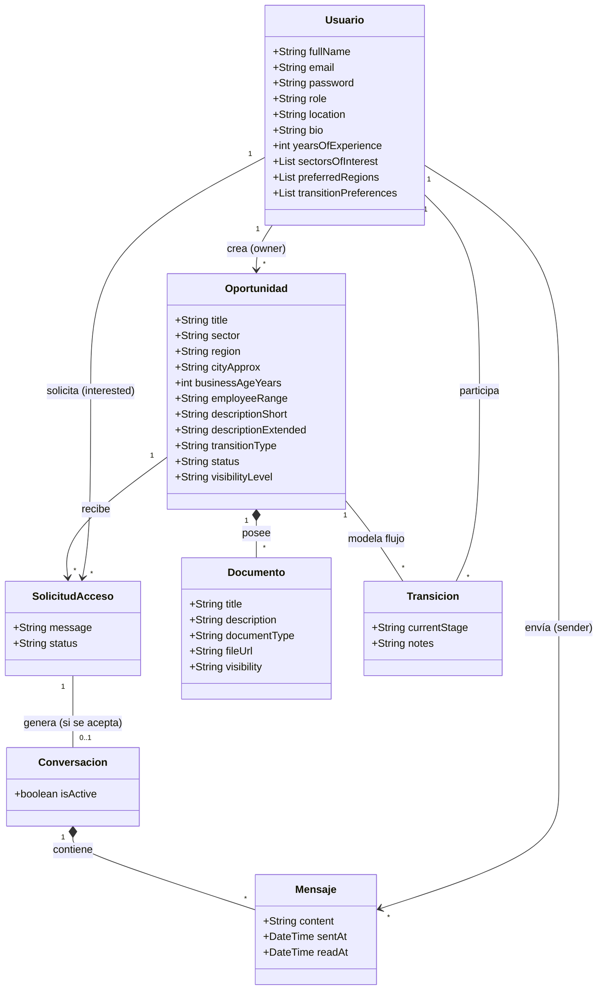

```mermaid
classDiagram
    class Usuario {
        +String fullName
        +String email
        +String password
        +String role
        +String location
        +String bio
        +int yearsOfExperience
        +List sectorsOfInterest
        +List preferredRegions
        +List transitionPreferences
    }

    class Oportunidad {
        +String title
        +String sector
        +String region
        +String cityApprox
        +int businessAgeYears
        +String employeeRange
        +String descriptionShort
        +String descriptionExtended
        +String transitionType
        +String status
        +String visibilityLevel
    }

    class SolicitudAcceso {
        +String message
        +String status
    }

    class Conversacion {
        +boolean isActive
    }

    class Mensaje {
        +String content
        +DateTime sentAt
        +DateTime readAt
    }

    class Documento {
        +String title
        +String description
        +String documentType
        +String fileUrl
        +String visibility
    }

    class Transicion {
        +String currentStage
        +String notes
    }

    %% Relaciones de cardinalidad y lógica
    Usuario "1" --> "*" Oportunidad : crea (owner)
    Oportunidad "1" --> "*" SolicitudAcceso : recibe
    Usuario "1" --> "*" SolicitudAcceso : solicita (interested)
    SolicitudAcceso "1" -- "0..1" Conversacion : genera (si se acepta)
    Conversacion "1" *-- "*" Mensaje : contiene
    Usuario "1" --> "*" Mensaje : envía (sender)
    Oportunidad "1" *-- "*" Documento : posee
    Oportunidad "1" -- "*" Transicion : modela flujo
    Usuario "1" -- "*" Transicion : participa
```
